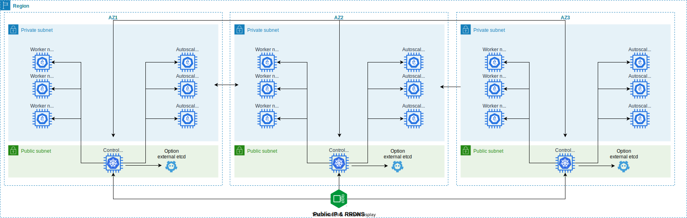
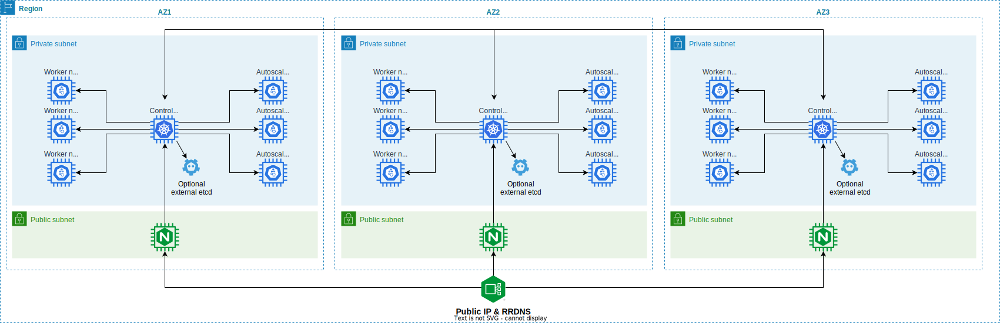
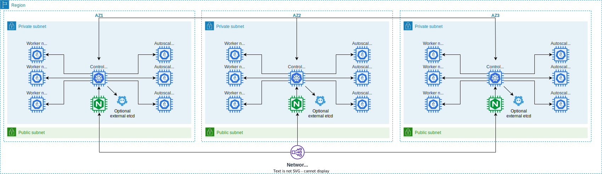
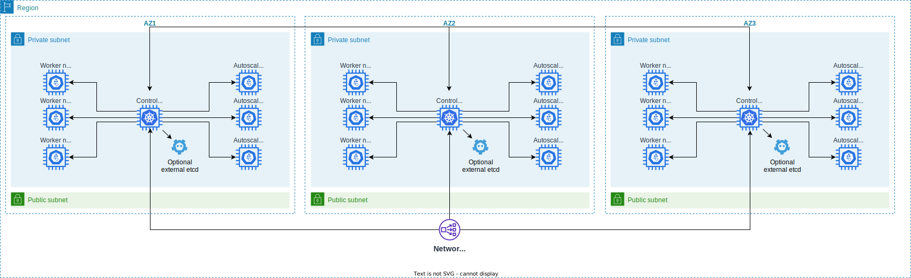

# Introduction

It's an EKS or Kops alternative.

The process install also following kubernetes components

* cert manager
* external dns
* aws efs csi driver
* aws ebs csi driver
* kubernetes dashboard and metrics scraper
* kubeapps
* rancher
* nginx ingress controller

# Example of kubernetes cluster created with this tool

## Mono AZ single plane exposed on internet

<p align="center">

<br>

</p>

## Multi AZ HA Cluster exposed on internet

<p align="center">

<br>

<br>

<br>

</p>

## Prepare the cluster

First step is to fill a file named **bin/plateform/aws/vars.defs** in the bin directory with the values needed

```
# AWS account identity
AWS_PROFILE=
AWS_REGION=

# AWS keys if no profile defined
AWS_ACCESSKEY=
AWS_SECRETKEY=
AWS_TOKEN=

# Route53 private ZoneID
AWS_ROUTE53_ZONE_ID=

# AWS Route53 account if different
AWS_PROFILE_ROUTE53=

# AWS keys if no route53 profile defined
AWS_ROUTE53_ACCESSKEY=
AWS_ROUTE53_SECRETKEY=
AWS_ROUTE53_TOKEN=

# Public and private domain name
PRIVATE_DOMAIN_NAME=
PUBLIC_DOMAIN_NAME=

# EC2 IAM Profile, will be created with essential rights if not defined
MASTER_INSTANCE_PROFILE_ARN=
WORKER_INSTANCE_PROFILE_ARN=

# VPC & Subnet to use
VPC_PUBLIC_SUBNET_ID=
VPC_PUBLIC_SECURITY_GROUPID=
VPC_PRIVATE_SUBNET_ID=
VPC_PRIVATE_SECURITY_GROUPID=

# GODADDY account
GODADDY_API_KEY=
GODADDY_API_SECRET=

# ZeroSSL account
ZEROSSL_API_KEY=
ZEROSSL_EAB_KID=
ZEROSSL_EAB_HMAC_SECRET=

```

## Create the cluster

```bash
./bin/create-masterkube \
    --plateform=aws \
    --ha-cluster \
    --verbose \
    --worker-nodes=3 \
    --use-nlb=cloud \
    --internet-facing \
    --profile=awsprofile \
    --region=us-east-1 \
    --seed-image=ami-085925f297f89fce1 \
    --kube-user=ubuntu \
    --kube-engine=rke2 \
    --public-subnet-id=subnet-123,subnet-456,subnet-789 \
    --public-sg-id=sg-1234 \
    --private-subnet-id=subnet-ABC,subnet-DEF,subnet-GHI \
    --private-sg-id=sg-5678 \
    --arch=arm64 \
    --cni-plugin=aws
```

## Specific plateform command line arguments added to commons

| Parameter | Description | Default |
| --- | --- |--- |
| | **Flags to set AWS informations** | |
| --profile \| -p=\<value\> | Specify AWS profile | ${AWS_PROFILE} |
| --region \| -r=\<value\> | Specify AWS region | ${AWS_REGION} |
| --route53-profile=\<value\> | Specify AWS profile for route53 if different | ${AWS_ROUTE53_PROFILE} |
| --route53-zone-id=\<value\> | Specify Route53 for private DNS | ${AWS_ROUTE53_PRIVATE_ZONE_ID} |
| | **Flags to set the template vm** | |
| --seed-image=\<value\> | Override the seed image name used to create template | ${SEED_IMAGE} |
| --kube-user=\<value\> | Override the seed user in template | ${KUBERNETES_USER} |
| --arch=[amd64\|arm64] | Specify the architecture of VM | ${SEED_ARCH} |
| --volume-type=[gp2\|gp3] | Override the root EBS volume type | ${VOLUME_TYPE} |
| --volume-size=\<value\> | Override the root EBS volume size in Gb | ${VOLUME_SIZE} |
| | **Flags for ha mode** | |
| --use-nlb=[none\|cloud\|nginx] | Use AWS NLB as load balancer or create nginx gateway  | |
| | **Flags to configure network in aws** | |
| --prefer-ssh-publicip | Allow to SSH on publicip when available | ${PREFER_SSH_PUBLICIP} |
| --internet-facing | Expose the cluster on internet | ${EXPOSE_PUBLIC_CLUSTER} |
| --public-subnet-id=\<subnetid,...\> | Specify the public subnet ID for created VM | ${VPC_PUBLIC_SUBNET_ID} |
| --public-sg-id=\<sg-id\> | Specify the public security group ID for VM | ${VPC_PUBLIC_SECURITY_GROUPID} |
| --private-subnet-id=\<subnetid,...\> | Specify the private subnet ID for created VM | ${VPC_PRIVATE_SUBNET_ID} |
| --private-sg-id=\<sg-id\> | Specify the private security group ID for VM | ${VPC_PRIVATE_SECURITY_GROUPID} |
| | **Flags to expose nodes in public AZ with public IP** | |
| --control-plane-public | Control plane are hosted in public subnet with public IP | ${CONTROLPLANE_USE_PUBLICIP} |
| --worker-node-public | Worker nodes are hosted in public subnet with public IP | ${WORKERNODE_USE_PUBLICIP} |

## Machine type

If you want to use another machine type, you must edit definition files [machines.json](./templates/setup/aws/machines.json)
